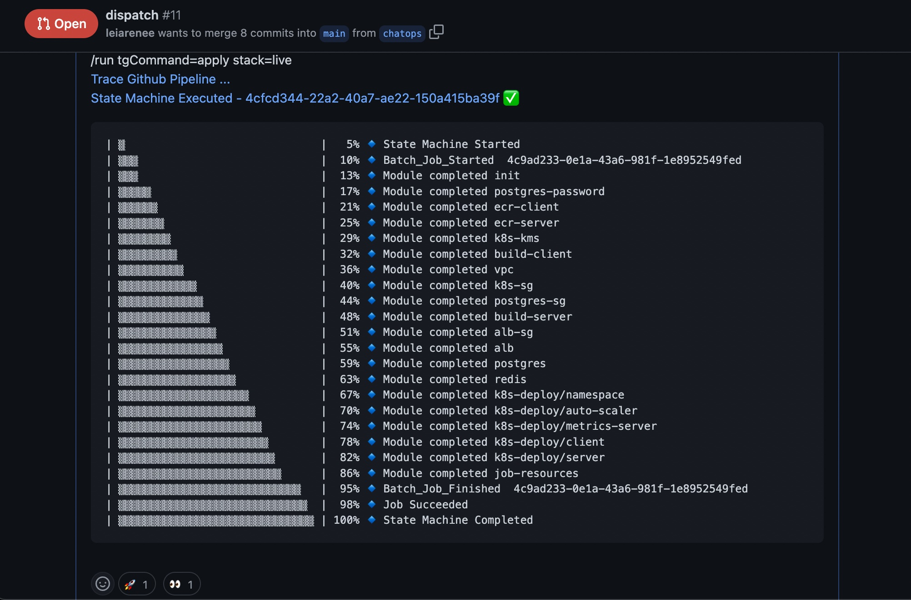
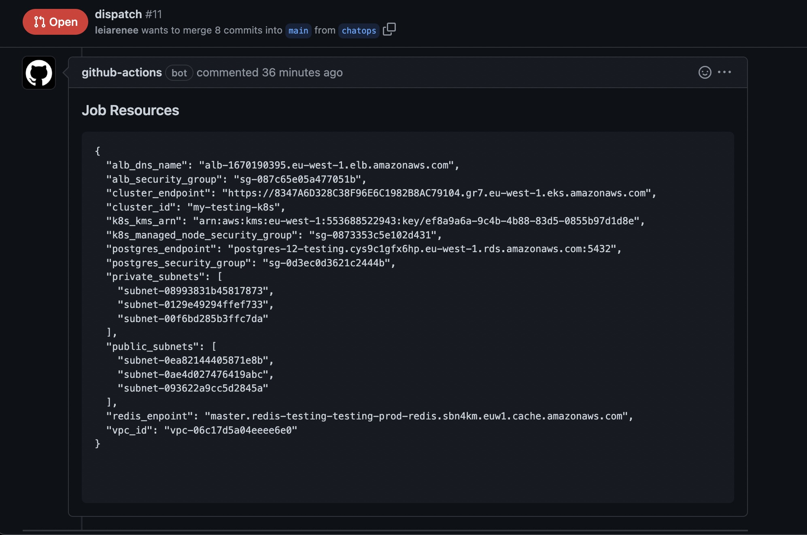

# SF-Pipeline

## Description

Continious deployment via GitOps approach using AWS Step-functions along with AWS Batch on Fargate to enqueue and orchestrate on-demand terraform/terragrunt jobs. 

### Example Run




### Example Plan


### Project Links

* [Architecture, System Design and Flow Diagrams](./docs/architecture/README.md)
* [Project Board](https://github.com/users/leiarenee/projects/1)
* [Road Map](https://github.com/leiarenee/sf-pipeline/milestones?direction=asc&sort=due_date)

### Repositories

* [Pipeline Repository](https://github.com/leiarenee/sf-pipeline)
* [Infrastructure Repository](https://github.com/leiarenee/sf-infra)
* [Application Repository](https://github.com/leiarenee/sf-app)

## Requirements

- [terraform](https://learn.hashicorp.com/tutorials/terraform/install-cli)
- [terragrunt](https://terragrunt.gruntwork.io/docs/getting-started/install/)
- [aws-cli](https://docs.aws.amazon.com/cli/latest/userguide/getting-started-install.html)
- [jq](https://stedolan.github.io/jq/download/)
- [python 3.9](https://www.python.org/downloads/)
- [direnv](https://direnv.net/docs/installation.html)
- [envsubst](https://www.gnu.org/software/gettext/manual/html_node/envsubst-Invocation.html)
- [rdfind](https://rdfind.pauldreik.se/)
- [uuidgen](https://man7.org/linux/man-pages/man1/uuidgen.1.html)

## Installation

Homebrew:
```sh
brew install terraform terragrunt awscli jq python@3.9 direnv gettext rdfind
```

<details>
<summary> Other</summary>

### Linux (and WSL)
```sh
# jq, direnv and python are available in standard package libraries
sudo apt-get install jq direnv python3 aws-cli gettext uuid-runtime

# For terraform you can either add the hashicorp repo:
curl -fsSL https://apt.releases.hashicorp.com/gpg | sudo apt-key add -
sudo apt-add-repository "deb [arch=amd64] https://apt.releases.hashicorp.com $(lsb_release -cs) main"
sudo apt-get update && sudo apt-get install terraform

#..or manually download the binary and place it somewhere (similar to process below)


# For terragrunt you need to manually download it to an appropriate folder and set as executable
# https://terragrunt.gruntwork.io/docs/getting-started/install/#download-from-releases-page
pushd /tmp/
wget https://github.com/gruntwork-io/terragrunt/releases/download/v0.36.3/terragrunt_linux_amd64
mv terragrunt_linux_amd64 ~/.local/bin/terragrunt # move to a folder that's in our $PATH
chmod +x ~/.local/bin/terragrunt # Make executable
popd
```

### Debugging installation problems

### `envsubst : command not found` 

You'll need to install `envsubst`. For Debian-like systems it is part ofthe `gettext-base` package
```sh
apt-get install gettext-base
```

</details>

<br>


